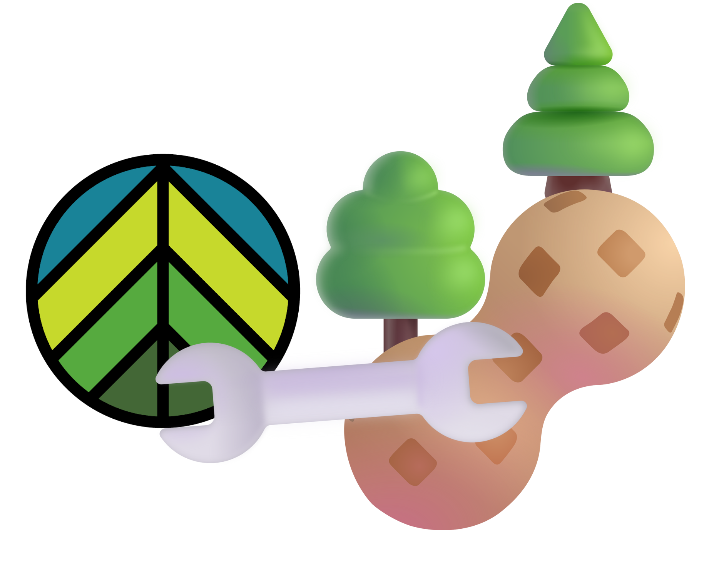

<h1 align="center">Calibration of PnET Succession for the <a src="https://diverseproject.uqo.ca">DIVERSE project</a></h1>

## 🎯 Objective

- This repo contains the files used to calibrate the canadian tree species we will simulate with the [PnET Succession Extension](https://github.com/LANDIS-II-Foundation/Extension-PnET-Succession) of the [LANDIS-II Forest Landscape Model](https://www.landis-ii.org/).
- These parameters will be used in simulations necessary for the [research theme 4](https://diverseproject.uqo.ca/theme-4-evaluation-various-forest-management-approaches/) of the pan-canadian [DIVERSE research project](https://diverseproject.uqo.ca), where several Functional Management Unit of Canada will be simulated with different forest management strategies.
- The calibration process used here is mostly based on the [calibration tips](https://research.fs.usda.gov/about/people/gustafson) of Eric Gustafson, available in the [PnET Succession v5.1 user guide](https://github.com/LANDIS-II-Foundation/Extension-PnET-Succession/blob/master/deploy/docs/LANDIS-II%20PnET-Succession%20v5.1%20User%20Guide.pdf).
    - The calibration is done in 5 steps of increasing complexity : calibrating species in monocultures and ideal conditions; calibrating species competition for light; calibration species competition for water; calibration of species competition with changing temperatures; and finally calibrating species establishment in the landscape.
- **💡 One of the main objectives here is to make this calibration process transparent and completly replicable, so as to facilitate future studies that will want to use PnET in different contexts, or with future versions**.
    - See the next section ⚙ **How to use** in order to deploy all of the files and programs used for this calibration on your computer. The process should be relatively simple. Feel free to post an issue if you encouter a problem.

## ⚙ How to use

- Install Docker Desktop on your computer (https://www.docker.com/products/docker-desktop/) or simply install Docker if you are using Linux.
- Clone or download the contents of this repository on your computer.
- Go to the folder `Clean_Docker_LANDIS-II_7_AllExtensions_PnETCalibration` in a terminal where you can call Docker (e.g. Windows Powershell)
- Use `docker build -t landis_ii_v7_calibration_pnet ./` to build the docker image. This image contains everything needed to re-do the calibration I've done here in a replicable way (including Jupyter lab to see read and act on the Jupyter notebook), and of course, LANDIS-II. The `Dockerfile` file contain all of the commands used to build the image, and comments about what versions of the LANDIS-II extensions are installed.
- Once the build is over, run `docker run -it -p 8888:8888 --mount type=bind,src="<CALIBRATION_FOLDER_PATH>",dst=/calibrationFolder landis_ii_v7_calibration_pnet` to open an interactive session with docker. Replace `<CALIBRATION_FOLDER_PATH>` with the full path to where the folder `Calibration_PnET_DIVERSE` is on your computer.
- Jupyter lab will automatically launch when launching the container. Simply click on the URL that it gives you (that will look like http://127.0.0.1:8888/lab?token=<LONG TOKEN>) or copy/paste it in your favorite web browser.
- In Jupyter lab, use the navigation pannel on the left to go to `/calibrationFolder` to open the Jupyter notebook corresponding to the calibration you are interested in. You can normally run every cell without any compatibility issue from here. You can also find some `.jupyterlab-workspace` files that will contain a whole workspace that can make things more confortable/more similar to what I used in the calibration process. 
- If you are using these files for your own calibration process, and if you need to add/update Python packages to the docker image to use them in the notebook, you can quit the jupyter lab instance and use `pip` to install them. However, these will be temporary. Editing the `Dockerfile` to add the `pip install ...` commands you need at the end and then re-building the image will make things permanent.

